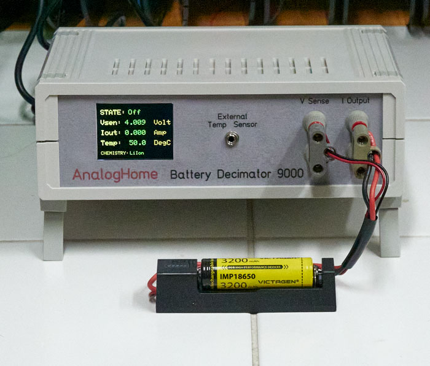
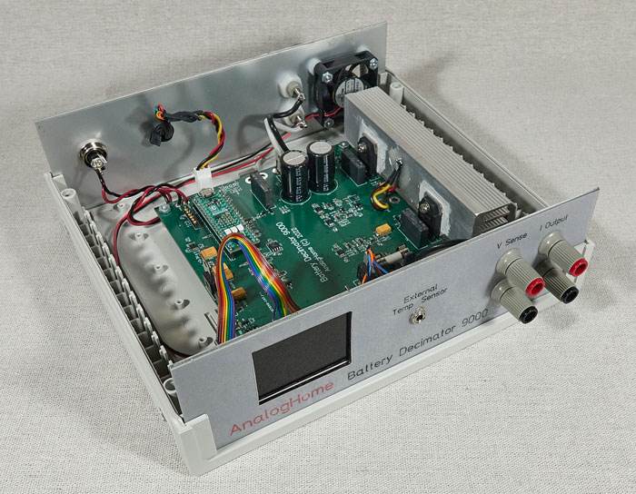

# Battery-Analyzer
The "Battery Decimator 9000" is a home built battery analyzer for small batteries in the range of 0-5amps and 0-14 volts.  

The full article is posted here,  
  https://www.edn.com/a-small-dedicated-battery-analyzer-design/
   
Finished BD9000,  

  
Interior View,  

   
This design was meant to provide me with a quick solution based largely on the junk box parts that I had available. It was designed with the goal of getting ‘one’ to work, and it served that purpose well. The design is not production ready and should be carefully analyzed before adapting it to any other application or need.  
  
Translation: This is total "Freeware" and "You are on your own".  
//--- Fini ---  
  
